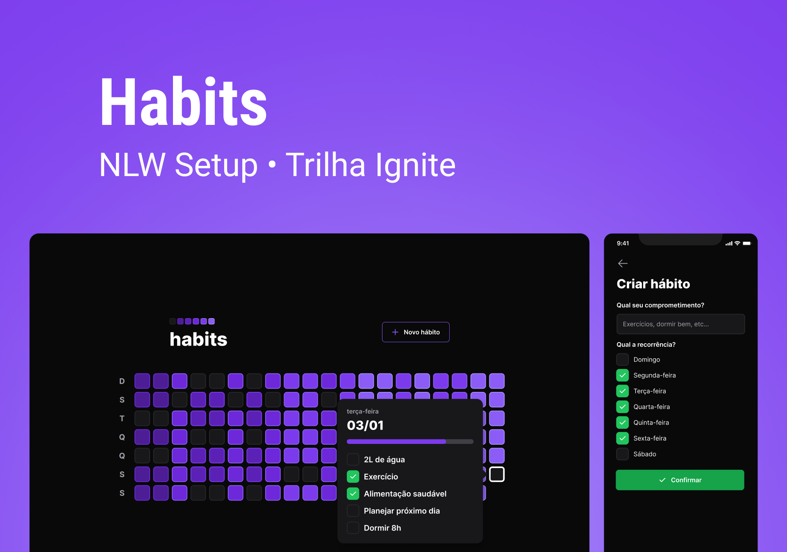

<div align="center" id="top">
  

  &#xa0;
</div>

<h1 align="center">NlW Setup - Habits</h1>

<p align="center">
  

  

  

  

<hr>

<p align="center">
  <a href="#dart-about">About</a> &#xa0; | &#xa0;
  <a href="#sparkles-features">Features</a> &#xa0; | &#xa0;
  <a href="#hammer-technologies">Technologies</a> &#xa0; | &#xa0;
  <a href="#rocket-want-to-run-in-your-machine">Starting</a> &#xa0; | &#xa0;
  <a href="#memo-license">License</a> &#xa0; | &#xa0;
  <a href="https://github.com/hlgboot" target="_blank">Author</a>
</p>

<br>

## :dart: About ##

Project developed at the NLW Setup event by [Rocketseat Education](https://github.com/rocketseat-education). This project is an habit-tracker that was created to save progress from day-to-day habits, such as go exercise.

## :sparkles: Features ##

- [x] Create habit
- [x] List habits
- [x] Check/UnCheck habits
- [x] Progress bar for habits
- [ ] Edit habit
- [ ] Delete habit
- [ ] Alert user about habits from day
- [ ] Authentication with Google
- [ ] Deploy

## :hammer: Technologies ##

The following tools were used to build this project:

- [Node.js](https://nodejs.org/en/)
- [SQLite](https://www.sqlite.org/index.html) 
- [Prisma](https://www.prisma.io/)
- [Fastify](https://www.fastify.io/)

- [React](https://pt-br.reactjs.org/)
- [Vite](https://vitejs.dev/)
- [Radix UI](https://www.radix-ui.com/)

- [React Native](https://reactnative.dev/)
- [Expo](https://expo.io/)

- [TypeScript](https://www.typescriptlang.org/)
- [TailwindCSS](https://tailwindcss.com/)

## :rocket: Want to run in your machine? ##

```bash
# Clone this project
$ git clone https://github.com/hlgboot/nlw-setup-habits

# Access api folder
$ cd nlw/api

# Install dependencies
$ npm i

# Access web folder
$ cd nlw/web

# Install dependencies
$ npm i

# Access mobile folder
$ cd nlw/mobile

# Install dependencies
$ npm i

# To run the project, you need to follow the run commands below:
# Access the api folder and run the command below, and the same for the web folder as well.
$ npm run dev 

# To mobile, create a .env file in root, create a IP_ADDRESS variable with your computer IP and execute command below:
$ npx expo start --clear

# The server will initialize in the <http://localhost:3333>
# The web will initialize in the <http://localhost:5173>
```

## :memo: License ##

This project is under license from MIT. For more details, see the [LICENSE](LICENSE.md) file.

Made with 💜 by [Matheus Henriques](https://github.com/hlgboot)

&#xa0;

<a href="#top">Back to top</a>